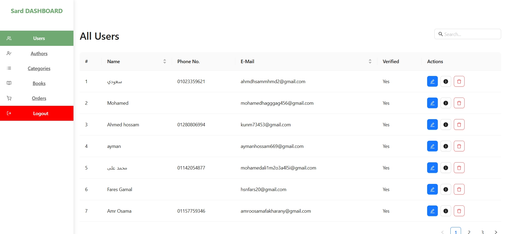

# Sard Dashboard - Admin Panel



## Overview

The Sard Dashboard is a comprehensive admin panel built with React that allows administrators to manage users, authors, books, categories, and orders. It features a clean, responsive interface with robust functionality for content management.

## Features

- **Authentication System**: Secure login with token-based authentication
- **User Management**: View, update, and manage users
- **Author Management**: CRUD operations for authors with image uploads
- **Book Management**: Add, edit, and delete books with multiple categories
- **Category Management**: Organize books into categories
- **Order Tracking**: View and manage customer orders
- **Responsive Design**: Works on desktop and mobile devices
- **Modern UI**: Built with Ant Design components

## Technologies Used

- **Frontend**: React (v18)
- **UI Framework**: Ant Design
- **Routing**: React Router
- **HTTP Client**: Axios
- **Build Tool**: Vite
- **Linting**: ESLint
- **Deployment**: Vercel

## Installation

1. Clone the repository:
```bash
git clone https://github.com/your-username/sard-dashboard.git
```

2. Install dependencies:
```bash
cd sard-dashboard
npm install
```

3. Start the development server:
```bash
npm run dev
```

## Project Structure

```
sard-dashboard/
├── public/
├── src/
│   ├── assets/             # Static assets
│   ├── components/         # Reusable components
│   │   ├── Auth/           # Authentication components
│   │   ├── Authors/        # Author management components
│   │   ├── Books/          # Book management components
│   │   ├── Categories/     # Category management components
│   │   ├── Orders/         # Order management components
│   │   ├── Sidebar/        # Navigation sidebar
│   │   └── Users/          # User management components
│   ├── pages/              # Page components
│   ├── routes/             # Application routes
│   ├── utils/              # Utility functions
│   ├── App.css             # Global styles
│   ├── App.jsx             # Main application component
│   ├── index.css           # Base styles
│   └── main.jsx            # Entry point
├── .eslintrc.js            # ESLint configuration
├── index.html              # Main HTML file
├── package.json            # Project dependencies
├── vercel.json             # Vercel deployment configuration
└── vite.config.js          # Vite configuration
```

## Configuration

The API endpoint is configured in `src/utils/api.js`:
```javascript
export const api_url = "https://api.mohamed-ramadan.me";
```

## Available Scripts

- `npm run dev`: Start development server
- `npm run build`: Build production bundle
- `npm run lint`: Run ESLint
- `npm run preview`: Preview production build

## Deployment

The project is configured for deployment on Vercel. The `vercel.json` file contains the necessary configuration for clean URLs and routing.

Live-Server : https://sard-dashboard.vercel.app/
